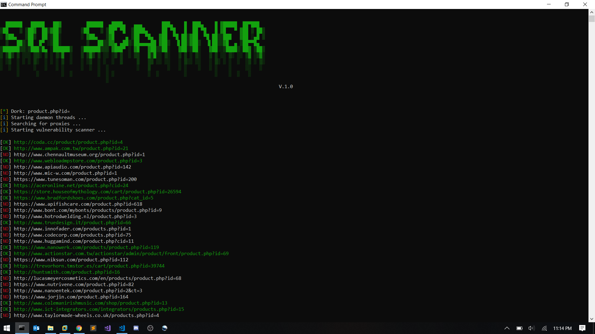

# SQL scanner

A tool that uses public proxies to find and scan sites for sql injection vulnerability<br>

__Usage:__ `python main.py -d product.php?id=`

### Requirements
- Python *v.2.x* **|** *v.3.x*

### Help
```
usage: main.py [-h] -d DORK [-w]

optional arguments:
  -h, --help            show this help message and exit
  -d DORK, --dork DORK  dork to search example: product.php?id=
  -w, --write-over      write over the existing log file
```

### Install 
`pip install -r requirements.txt`

### Don't write over existing log file 
`python main.py -d product.php?id=`

### Writing over existing log file 
`python main.py -d product.php?id= -w`

### Screenshot


### Original Author
<a href="https://github.com/Ranginang67"></a>
